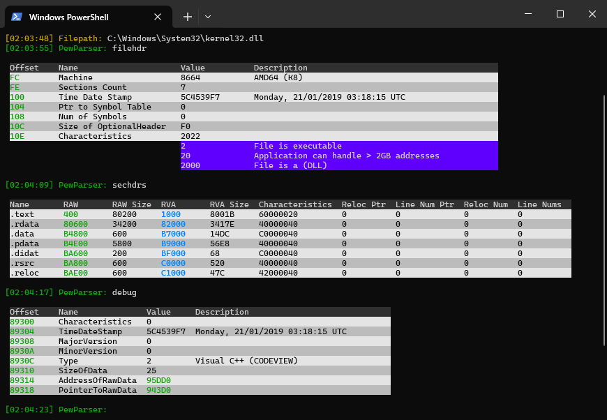
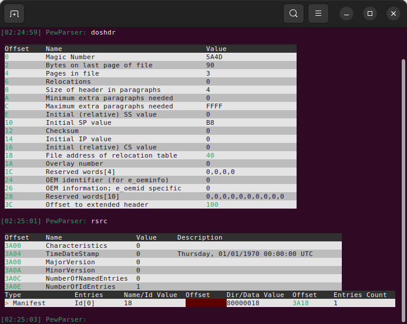

# PewParser

A lightweight, user-friendly C++ library and console application for parsing Windows Portable Executable (PE) files (.exe, .dll). With no dependencies needed.

## Screenshots



## Installation
Linux:
```console
$ git clone https://github.com/0xl0/PewParser.git
$ cd PewParser && chmod +x generate-makefile.sh
$ generate-makefile.sh
$ make
```

Windows:
```
run build-windows-vs19.bat or 22 to generate visual studio projects
```

### Recommendation
On Windows use [Windows Terminal](https://github.com/microsoft/terminal) for better experience

## Available Commands
```console
$ doshdr
$ filehdr
$ opthdr
$ sechdrs
$ exportdir
$ exports
$ imports
$ boundimports
$ rsrc
$ debug
```

## Library Usage Example

Validate PE:
```c++
#include <PewParser/PewParser.h>

#include <iostream>
#include <filesystem>

int main()
{
    using namespace PewParser;

    std::filesystem::path pe_path("pe.exe");

    RawFile raw_file = LoadFile(pe_path);

    if (raw_file)
    {
        PEType pe_type = PEParser::ValidatePE(raw_file);

        if (pe_type == PEType::NotPE)
        {
            std::cerr << "File is not portable executable\n";
            raw_file.Delete();
            return -1;
        }
        else if (pe_type == PEType::Corrupted)
        {
            std::cerr << "PE is corrupted\n";
            raw_file.Delete();
            return -1;
        }

        PEFile* pe = PEParser::MakePE(raw_file, pe_type);

        // Get PE Content

        delete pe;
    }
    else
        std::cerr << "Failed to load file\n";
}
```

Get File Header:
```c++
FileHdrWrapper* file_hdr_wrapper = pe->GetFileHdrWrapper();

std::cout << std::hex;
for (size_t field = 0; field < file_hdr_wrapper->GetFieldsCount(); field++)
{
    std::cout << file_hdr_wrapper->GetFieldOffset() << "\t";
    std::cout << file_hdr_wrapper->GetFieldName() << "\t";

    if (file_hdr_wrapper->GetFieldType() == FieldType::WORD)
        std::cout << *(WORD*)file_hdr_wrapper->GetFieldValue() << "\t";
    else if (file_hdr_wrapper->GetFieldType() == FieldType::DWORD)
        std::cout << *(DWORD*)file_hdr_wrapper->GetFieldValue() << "\t";

    if (file_hdr_wrapper->IsFieldDescribed())
        std::cout << file_hdr_wrapper->GetFieldDescription();

    std::cout << std::endl;

    file_hdr_wrapper->LoadNextField();
}
file_hdr_wrapper->Reset()
```

Output:
```console
104     Machine                  14C            Intel 386
106     Sections Count           6              
108     Time Date Stamp          66E5BEA9       Saturday, 14/09/2024 16:49:45 UTC
10C     Ptr to Symbol Table      0              
110     Num of Symbols           0              
114     Size of OptionalHeader   E0             
116     Characteristics          102            
```
